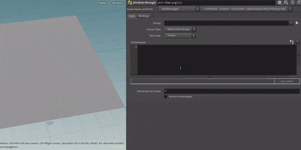

# ADL Parameter Parser

This is a drop-in replacement for houdini's vexpressionmenu.py which adds support for simple (and complex!) in-line parameter specification (similar to OSL). The script is compatible with VEX and OpenCL by overriding the internal function used to populate a code snippet's parameters. Since this replaces a core function in houdini, a high priority of this project has been ensuring that the default behavior remains untouched.



The idea of this script is to allow for easily reusable code snippets, without the need for an entire HDA. In many scenarios, I find myself writing self-contained VEX scripts which aren't complex enough to justify an HDA, but would benefit from a more complex parameter interface. In addition, this allows for complex parameter interfaces to be specified anywhere that the "create spare parameters" button is present (since this is the function it replaces). 
# Full Snippet Examples
The best way to understand the formating of the parser is to see it in use.\
A few useful snippepts are included in this repo: [Full Examples](./examples)\
In addition, small snipets demonstrating individual parts of the parser are below.
# Installation
Method 1 **(recommended)** - User Prefs Folder:\
 ``$USER_PREFS/pythonX.Xlibs`` (for example ``C:\Users\Andrew\Documents\houdini20.0\python3.10libs\vexpressionmenu.py``)\
Method 2 - Overwriting the original in directlty in Houdini's core files:\
``$HFS\Houdini\pythonX.Xlibs`` (for example ``C:\Program Files\Side Effects Software\Houdini 20.0.688\houdini\python3.10libs``)

# Compatibility
This script is a modification of Houdini 20.0's vexpressionmenu.py script, so it is tested and confirmed working with Houdini 20.0.688. It has also been tested with Houdini 19.5.805, which has the added benefit of backporting the newer style of putting parameters above the snippets. It has been tested in Python 3.9 and 3.10 and is likely compatible with other versions.

In addition, the following are a series of VEX snippets which demonstrate different aspect of the parser's functionality. I'd recommend pasting them into a wrangle and seeing what happens. OpenCL is also supported, and the parser's syntax is identical.
# Individual Examples
### Common arguments
In it's simplest form, the parser can be used to set default, min, and max values.
```
v@P += chv('offset1'); // adlParm[[ default=2 ]]
v@P += chv('offset2'); // adlParm[[ default=(1,2,3) ]]
v@P.y += chf('offset2'); // adlParm[[ default=1.5, min=-2, max=2, minlock=1 ]]
```
### Parameter targeting
###### :warning: ***Parameters MUST be explicitly defined in OpenCL, as it uses a different way of specifying parameters.***
```
// This will result in standard sliders for x_offset and z_offset, with a custom default and maximum value for y_offset.
v@P.x += chf('x_offset');
v@P.y += chf('y_offset'); // adlParm[[ default=2, max=4 ]]
v@P.z += chf('z_offset');
// If a parm is not specified in an adlParm, it will look for the nearest parameter reference before it in the code.
```
```
// Alternativley, you can directly declare a target parameter for an adlParm
v@P.x += chf('x_offset');
v@P.y += chf('y_offset');
v@P.z += chf('z_offset');
// adlParm[[ parm=x_offset, default=1, min=-3, max=3]]
// adlParm[[ parm=z_offset, default=2.3, min=-3, max=3]]
```
### Toggle parameters
```
// The following will create a toggle parameter instead of a standard int
if(chi('enable_offset')){
    v@P.y += 2;
}
// adlParm[[parm=enable_offset, type=toggle]]
```
### Menu parameters
```
// Menu parameters will automatically be created if a relevant menu argument is specified for either a string or int parameter.
// You can either specify menu_items and menu_labels separately (or just menu_items alone), or as a menu_pairs dict.
string bark_type = chs('bark_type'); // adlParm[[ menu_items=('elm','oak'), menu_labels=('Elm Tree','Oak Tree') ]]
// For strings, default values are one of the menu_items, while it is an index for ints
string wood_type = chs('wood_type'); // adlParm[[ default=oak, menu_pairs={'elm':'Elm Tree','oak':'Oak Tree'} ]]
int branch_type = chi('branch_type'); // adlParm[[ default=1, menu_items=('Elm Tree','Oak Tree')]]
```
### Presets
For a few common usecases, there are presets which can be specified that populate the approprate tags and arguments for complex parameters.
- attribSelect
    ```
    // attribSelect creates the appropriate tags and menu configurations needed to have an attribute selector and visualizer.
    string target_attribute = chs('attribute_to_modify'); // adlParm[[default=mask, preset=attribSelect]]
    ```
- lopPrimSelect
    ```
    // lopPrimSelect create the appropriate tags for a string parameter which autocompletes Solaris paths
    // with a primitive selection button as well
    string prim_to_read = chs('prim_to_read'); // adlParm[[ preset=lopPrimSelect ]]
    ```
### Visibility and limits
```
// This will create a toggle joined to a float slider, which is locked to it's min and max values, in addition to an invisible string parm.
chs('object'); // adlParm[[ hidden=1 ]]
if(chi('enable_offset') ){ // adlParm[[ type=toggle, labelhidden=1, hjoin=1]]
    v@P.y += chf('y_offset'); // adlParm[[ min=-2, max=2, minlock=1, maxlock=1]]
}
```
### Conditional visibility
It is possible to specify disablewhen and hidewhen conditionals, which is especially useful when combined with menus, toggles, and folders.
```
// This is similar to the previous snippet, but the sliders have their visibility tied to the toggle.
if(chi('enable_offset') ){ // adlParm[[ type=toggle, labelhidden=1, hjoin=1]]
    v@P.y += chf('y_offset'); // adlParm[[ disablewhen='{ enable_offset != 1 }' ]]
    v@P.z += chf('z_offset'); // adlParm[[ hidewhen='{ enable_offset != 1 }' ]]
}
```
### Folders
```
// This will place the following two parameters in the folder Offsetting,
// creating a standard folder since it's arguments were not specified
vector offset = chv('offset'); // adlParm[[ folder=offseting ]]
float mask = chf('offset_amount'); // adlParm[[ folder=offseting ]]
```
```
// Optionally, it is possible to specify folder configurations with adlParm, whose configuration will be used insead of the default.
int enable_offset = chi('enable_offset'); // adlParm[[type=toggle,default=1]]
// adlFolder[[name=offsetting, type=collapsible, disablewhen='{ enable_offset != 1 }' ]]
vector offset = chv('offset'); // adlParm[[ folder=offsetting ]]
float mask = chf('offset_amount'); // adlParm[[ folder=offsetting, minlock=1, maxlock=1 ]]
v@P += offset*mask;
```
By default, folders are only construced if they appear in a specific parameter, but they can be set to be created independent of (and before) the parameters. Independent folders will be placed in the order they are found, NOT the order they are used in adlParms. Try disabling the independent argument to see the different behavior.
```
// adlFolder[[name=containing_folder, independent=1, type=radio ]]
// It is also possible to specify parent folders, though be cautious about the order they are called.
// adlFolder[[name=main_config, independent=1, type=tabs, parent_folder=containing_folder]]
// adlFolder[[name=secondary_config, independent=1, type=tabs, parent_folder=containing_folder]]
chf('slider1'); // adlParm[[folder=main_config]]
```
### Expressions
It is possible to specify default expressions, which can be simple parameter references, or complex multiline code snippets themselves
```
float mask = chf('mask'); // adlParm[[  min=-1, default_expression='sin(deg($T*0.25*$PI))' ]]
```
```
float val1 = chf('val1');
float mask = chf('mask');
/* 
adlParm[[ default_expression_language=Python, default_expression=
'''import math
output = math.sin( hou.time() )
return output''']]
*/
```
### Direct Kwargs
If you want to use a part of a ParmTemplate that isn't already supported, it is possible to pass Kwargs directly into a template, which will override any default or otherwise defined arguments. This should be written as a python-style dictionary.
```
chf('slider'); // adlParm[[ min=1,max=4,default=2, kwargs={'default_value':(3.5,), 'script_callback':"print('test',1+2)" } ]]
```
### Tags
You are also able to directly specify parameter tags as a dictionary, which can allow for some complex behavior.
```
chf('float_slider'); // adlParm[[ max=10, tags={'sidefx::slider':'snap_to_int'} ]]
```
### Direct Template Specification
For the most control (and complexity) you can specify a parameter template, which will override all the automatic template selection and default values that the parser normaly does. It is highly recomended to explicitly specify your arguments as well, as they can vary across templates.
```
chf('float_one');
chi('sep'); // adlParm[[template='SeparatorParmTemplate', args=('sep',), kwargs={} ]]
chf('button_one');
/* adlParm[[template='ButtonParmTemplate',args=('button_one','Button One'), 
kwargs={'script_callback':"print('Click!')",'tags':{'script_callback_language':'python'} } ]] */
```
### Metadata
There are also a few settings which you might want to define for your entire script, including the ability to disable the enhanced parser alltogether (disableall). This is useful for seeing how the parameters will be created if you don't have the script installed. By default, the parser will not modify parameters that already exist, but this can be changed with the replaceall setting. NOTE: Replace does not effect folders, as updating their position and dependencies is a headache I didn't feel was necessary.
```
// Try changing the disableall setting to see the difference!
// adlMeta[[ disableall=1, replaceall=1 ]]
chf('slider'); // adlParm[[min=-3.2,max=5,default=2]]
```
# List of possible adlParm Arguments
Many of these arguments directly correspond to parts of the ParmTemplates, but some have had their behavior slightly adjusted for ease of use. As said above, through the Template, Arg, Kwarg, and Tags arguments, essentially all aspects of parameter templates are supported.
- **parm** : String. The parameter that is being customized. If not present in VEX, this can be automatically set.
- **default** : Float/Int/String or Tuple, Sets the default value, can be a single value or optionaly a tuple for multi-component parms. Corresponds to default_value.
- **min** : Float/Int. Sets the minimum value. Same name as python arg.
- **max** : Float/Int. Sets the minimum value. Same name as python arg.
- **minlock** : Boolean. Limits to the min value. Corresponds to min_is_strict.
- **maxlock** : Boolean. Limits to the min value. Corresponds to max_is_strict.
- **hidden** : Boolean. Hides the entire parameter. Corresponds to is_hidden.
- **label_hidden** : Boolean. Hides the label component of a parameter. Corresponds to is_label_hidden.
- **hjoin** : Boolean. Horizontally joins a parameter with the following one. Corresponds to join_with_next.
- **label** : String. Overrides the automatic label given to a parameter. Same name as python arg.
- **help** : String. The string which appears when hovering over a parameter. Same name as python arg.
- **default_expression** : String or Tuple. Either a Hscript or Python expression to use instead of the value. Same tuple behavior as default. Same name as python arg.
- **default_expression_language** : String or Tuple. Similar to default and default_expression, this can be a tuple as well. Defaults to Hscript. Possible values are within the hou.scriptLanguage module.
- **size** : Int. Overrides the number of components in a float/int. Same name as python arg.
- **disablewhen** : String. A condition which decides if a parameter should be enabled. Formatted as { parm_foo >= bar }. Corresponds to disable_when.
- **hidewhen** : String. A condition which decides if a parameter should be hidden. Formatted as { parm_foo >= bar }. Does not correspond to a ParmTemplate arg.
- **type** : String. Sets what kind of parameter it should be. Currently only supports 'toggle'
- **preset** : String. adds relevant arguments for certain presets. Current presets are zeroCentered, attribSelect, and lopPrimSelect
- **menu_items** : String Tuple. A list of menu items for a string or int parameter. Same name as python arg.
- **menu_labels** : String Tuple. Optional tuple of menu labels to change the option shown in the interface. Same name as python arg.
- **menu_pairs** : String Dictionary. As an alternative to menu_items and menu_labels, a single menu_pairs dict can be specified with item:label pairs.
- **icon_names** : String Tuple. Optional tple of icons corresponding to menu items. Same name as python arg.
- **item_generator_script** : String. Either a Hscript or Python expression to generate menu items. Same name as python arg.
- **item_generator_script_language** : String. Sets the language for item_generator_script. Defaults to Python. Possible values are within the hou.scriptLanguage module.
- **menu_type** : String. Defaults to Normal. Possible values are within the hou.menuType module.
- **template** : String. Overrides the ParmTemplate used for a given parameter. Valid values can be found in the hou.ParmTemplate class in the docs.
- **tags** : Dictionary. Sets tags for the parameter. Same name as python arg.
- **args** : Tuple. Used when a template is explicitly set. This should contain all the required args for a given ParmTemplate.
- **kwargs** : Dictionary. This takes priority over any previously extracted or automatically set kwargs for a template.
- **folder** : String. Sets the containing folder for the parameter. If the folder name is not defined by an adlFolder, a simple folder will be created (if one doesn't exist).

# List of possible adlFolder Arguments
- **name** : String. The name of the folder. This is what name will be looked for by an adlParm's folder setting. All folders are placed within the snippet's default folder.
- **parent_folder** : String. The containing folder of the current folder. Be careful about the order in which the folders are created.
- **independent** : Boolean. Folders are normally constructed the first time that they occur in an active parameter. By default, if an adlFolder is not directly referencedm it wil never be created. If independent, they will instead be placed before any of the parameters are created. This is useful for top-level folders.
- **label** : String. Overrides the automatic label given to a folder. Same name as python arg.
- **hidden** : Boolean. Hides the entire folder. Corresponds to is_hidden.
- **folder_type** : String. Sets the folder type for the folder. Defaults to Simple. Possible values are within the hou.folderType module.
- **endstabgroup** : Boolean. Sets if the folder is the end of a group of folders. Corresponds to ends_tab_group.
- **disablewhen** : String. A condition which decides if a folder (and it's connected tabs) should be enabled. Formatted as { parm_foo >= bar }.
- **hidewhen** : String. A condition which decides if a folder (and it's connected tabs) should be hidden. Formatted as { parm_foo >= bar }.
- **conditionals** : Dictionary. Instead of separate hidewhen and disablewhen, a single dictionary can be passed through. Same name as python arg (slightly complex syntax. Check docs.).
- **tab_disablewhen** : String. A condition which decides if a folder should be enabled. Formatted as { parm_foo >= bar }.
- **tab_hidewhen** : String. A condition which decides if a folder should be hidden. Formatted as { parm_foo >= bar }.
- **tab_conditionals** : Dictionary. Instead of separate tab_hidewhen and tab_disablewhen, a single dictionary can be passed through. Same name as python arg (slightly complex syntax. Check docs.).
- **tags** : Dictionary. Sets tags for the folder. Same name as python arg.
- **kwargs** : Dictionary. This takes priority over any previously extracted or automatically set kwargs for a folder.

# List of possible adlMeta Arguments
- **disableall** : Boolean. Disables adl parser extraction, causing the script to behave identically to a "stock" installation. This can be useful when testing scripts.
- **replaceall** : Boolean. By default, the parser will not modify parameters that already exist, but this can be changed with the replaceall setting. NOTE: Replace does not effect folders, as updating their position and dependencies is a headache I didn't feel was necessary.